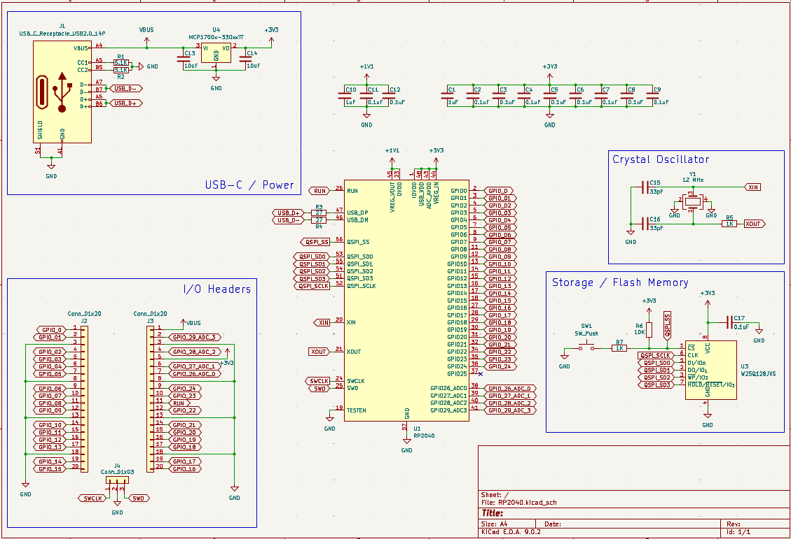
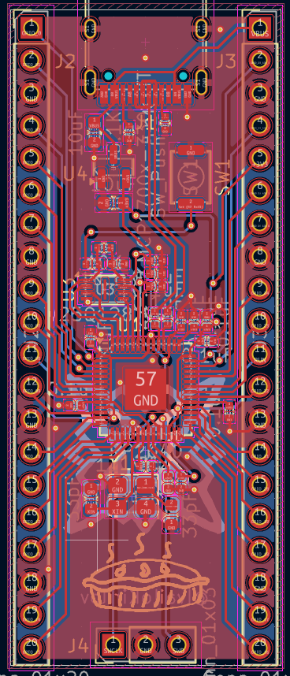
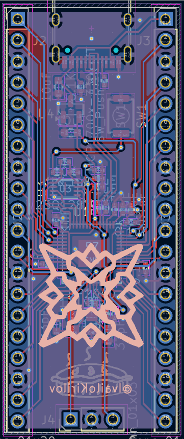
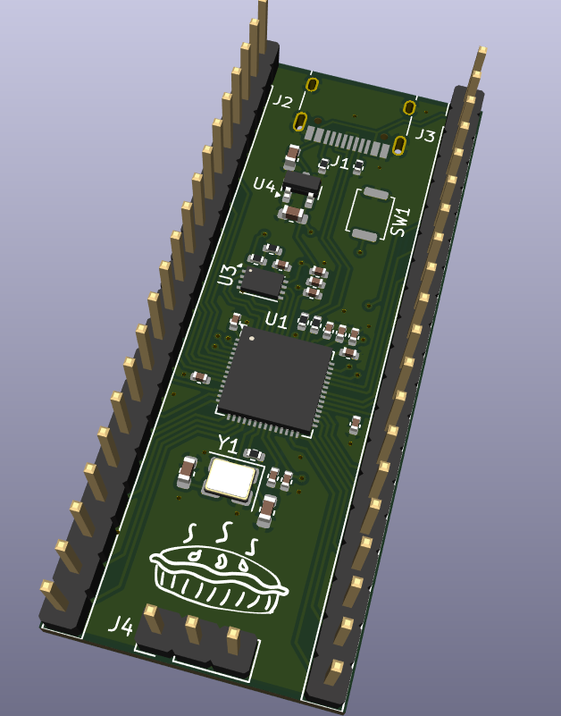
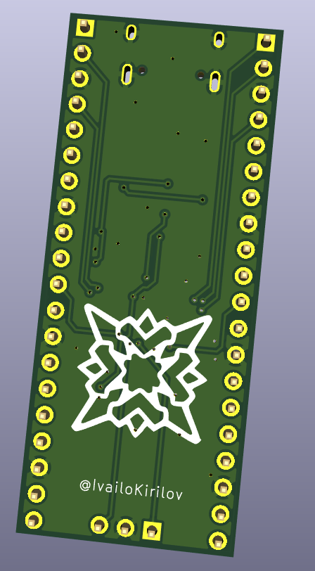

# Custom-RP2040-Board
This board is a simple RP2040 based MCU. The PCB was made with the help of the guide from Hack Club Stasis. 

I decided to make this board because I had wanted to make my own MCU for a while and when I saw the guide I instantly knew I had to make it. I learned quite a bit while making this project and now I will be bale to use this board for other projects.

This board has taken me about 7-8 hours to fully make. Below I have put some images of the finished board.

Schematic:

PCB (front):

PCB (back):

3D View (top):

3D View (bottom):
